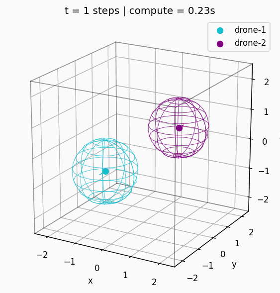
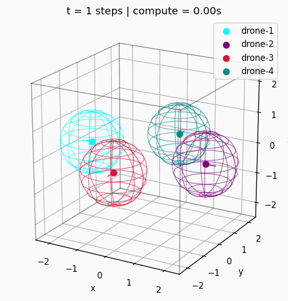
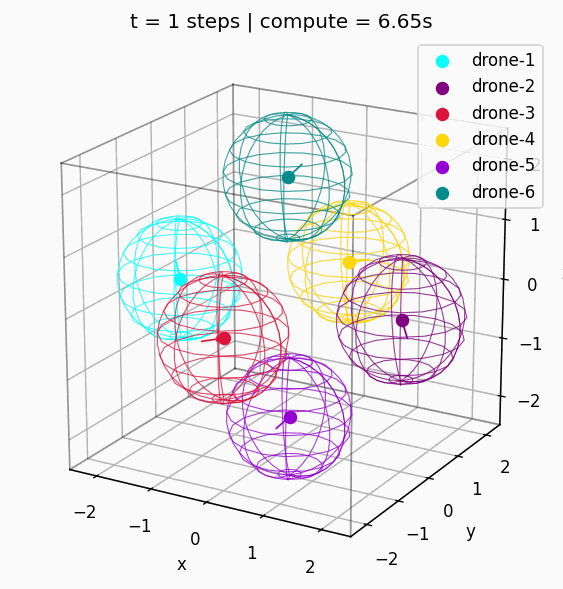

# Geometric and Control-Theoretic Limits – Simulation Guide

This document describes how to reproduce, verify, and visualize the simulation scenarios used in the paper *“Geometric and Control-Theoretic Limits on Drone Density in Bounded Airspace”* with this repository.  
The configuration files under `configs/basic_paper` implement the MPC framework described in the paper. The overall software architecture is intentionally kept relatively modular and complex in order to make it straightforward to extend the implementation with additional controllers, physics models, and scenarios beyond those used in the manuscript.

## 1. Setup

Requirement: Python 3.11+ (or a compatible version).

```bash
python -m venv .venv
source .venv/bin/activate
pip install -e ".[dev]"
```

## 2. Central MPC Architecture in the Codebase

All paper experiments use the same centralized MPC architecture:

- **Per-drone controller**  
  `controller.type = "mpc_agent"`  
  Implementation: `src/drone_sim/controllers/central_cost.py` (`CentralMPCAgent`)

- **Central coordinator**  
  `coordinator.type = "mpc_central"`  
  Implementation: `src/drone_sim/simulation/coordinator.py` (`CentralMPCGlobalCoordinator`)

- **Simulator**  
  Implementation: `src/drone_sim/simulation/simulator.py` (`Simulator`)
  - Constructs from `ScenarioConfig`:
    - the physics model (`linear_kinematics`),
    - all `Drone` objects,
    - obstacles and room bounds.
  - For each time step it:
    1. Evaluates the local controller of each drone (used for non-optimized drones and as fallback),
    2. Invokes the coordinator (`solve_controls`) to perform the global SLSQP solve,
    3. Applies the physics update and collision detection.


<p align="center">
  
</p>

<details>
<summary><strong>Json Configuration for this scenario:</strong></summary>

All paper scenarios are defined in `configs/basic_paper/*.json` and follow the pattern:

```json
{
  "dt": 0.1,
  "room": { "min": [...], "max": [...] },
  "physics": { "type": "linear_kinematics", "params": {} },

  "controller": {
    "type": "mpc_agent",
    "params": {
      "horizon": H,
      "q_pos": [qx, qy, qz],
      "r_u": [rx, ry, rz],
      "u_min": [-3.0, -3.0, -3.0],
      "u_max": [ 3.0,  3.0,  3.0]
    }
  },

  "coordinator": {
    "type": "mpc_central",
    "params": {
      "horizon": H,
      "room_wall_tolerance": 0.5,
      [...]
    }
  },

  "drones": [...],
  "obstacles": [...]
}
```

</details>

## 3. REST API and Live Visualization

### 3.1 Starting the REST Server

From the repository root:

```bash
uvicorn drone_sim.api.app:app --reload
```

The server will listen on `http://127.0.0.1:8000`.

### 3.2 Loading Scenarios and Stepping the Simulation via REST

Example using the paper configuration `2DronesHorizon2.json`:

```bash
curl -s -X POST http://127.0.0.1:8000/config \
  -H "Content-Type: application/json" \
  --data-binary @configs/2DronesHorizon2.json

curl -s -X POST "http://127.0.0.1:8000/step?n=10"
curl -s http://127.0.0.1:8000/state
```

### 3.3 Live View and GIF Generation

In a **second terminal** (with the server already running):

```bash
python -m tools.live_view \
  --config configs/2DronesHorizon2.json \
  --steps 200 \
  --trace-len 100 \
  --gif results/2DronesHorizon2.gif \
  --gif-fps 20
```

The results for the given json configuration are those:
<p align="center">
  
  
</p>

<p align="center">
  
  
</p>
Four-drone scenarios are easily solvable, but the chosen horizon should be neither too small nor too large.
Six-drone scenarios are solvable, a small horizon will result in many calculation steps, a large horizon will slow down the calculation.

## 4. Verification of Constraints

For the paper’s evaluation, the key constraints are checked numerically:

- minimum separation of safety zones,
- maximum speed,
- room (workspace) constraint.

The verification script is:

```bash
python -m tools.verify_basic_paper --steps 200
```

It iterates over all `configs/*.json` and prints output of the form:

```text
2DronesHorizon2.json:
  min pairwise margin  :  0.7428  (>= 0 means no safety-zone overlap)
  max speed            :  1.5267
  min room margin      : -0.1000  (>= 0 means safety spheres inside room)
  collisions reported  : none
```

Interpretation:

- **min pairwise margin**  
  $$
    \min_{i\neq j} \left(\|p_i - p_j\|_2 - (s_i + r_j)\right),
  $$
  where `s_i` is the safety zone radius and `r_j` is the physical radius.  
  - `>= 0`: safety zones do not overlap (no violation of the safety distance).
  - Values on the order of $0.09$–$0.95$ indicate that drones remain at least the prescribed safety margin apart.

- **max speed**  
  $$
    \max_i \|v_i\|_2,
  $$
  i.e., the maximum speed of any drone over the entire simulation.

- **min room margin**  
  The minimum distance of any safety sphere to the room boundary:
  - Positive: all safety spheres remain strictly inside the room.
  - `0.0`: tangential contact with a wall.
  - Small negative values (e.g., $-0.10$) can be interpreted as numerical or discretization tolerances.

- **collisions reported**  
  `Simulator._compute_collisions()` counts events where the defined safety zone is actually violated.  
  For the paper configurations, this should report `none`.

## 5. MPC Model (Brief Description)

### 5.1 Dynamics

Each drone is modeled as a discrete-time double integrator in three dimensions:

- State  $x_k = [p_{x,k}, p_{y,k}, p_{z,k}, v_{x,k}, v_{y,k}, v_{z,k}]^\top \in \mathbb{R}^6$
- Input (acceleration) $u_k = [a_{x,k}, a_{y,k}, a_{z,k}]^\top \in \mathbb{R}^3$
- Sampling time $\Delta t = 0.1 \,\text{s}$.
- Discrete-time dynamics $x_{k+1} = A x_k + B u_k$, with
  $$
  A = \begin{bmatrix}
      I_3 & \Delta t\, I_3 \\
      0_3 & I_3
  \end{bmatrix},
  \quad
  B = \begin{bmatrix}
      \tfrac{1}{2}\Delta t^2 I_3 \\
      \Delta t I_3
  \end{bmatrix}.
  $$

The implementation is provided by `LinearKinematicsPhysics` in `src/drone_sim/physics/linear_kinematics.py`.

### 5.2 Cost Function

For each drone \(k\) with reference position \(\bar p_k\) and prediction horizon \(H\), the stage cost is

  $$
  J_k = \sum_{h=0}^{H-1}
  \left(
    (p_k(h) - \bar p_k)^\top Q_p (p_k(h) - \bar p_k)
    + v_k(h)^\top Q_v v_k(h)
    + u_k(h)^\top R u_k(h)
  \right),
  $$

where:

- $Q_p = \mathrm{diag}(q_{p,x}, q_{p,y}, q_{p,z})$ is derived from `q_pos` in the JSON configuration,
- $Q_v = \mathrm{diag}(q_{v,x}, q_{v,y}, q_{v,z})$ is configured in `CentralMPCAgent` (typically with relatively small weights),
- $R = \mathrm{diag}(r_{u,x}, r_{u,y}, r_{u,z})$ is derived from `r_u`.

The central coordinator minimizes the aggregate cost over all drones:

$$
J = \sum_{k=1}^N J_k.
$$

### 5.3 Constraints

The main constraints (implemented in the `mpc_central` coordinator) are:

1. **Inter-drone distance**  
   For all drone pairs \(i \neq j\) and all prediction steps \(h\):
   $$
   \|p_i(h) - p_j(h)\|_2
   \;\ge\;
   \max\bigl(s_i + r_j,\; s_j + r_i\bigr) + \text{safety\_buffer}.
   $$
   Here \(s_i\) is the safety zone radius of drone \(i\), and \(r_i\) is its physical radius.

2. **Input (acceleration) bounds**  
   Component-wise,
   $$
     u_{\min} \le u_k(h) \le u_{\max}
   $$
   using `u_min` and `u_max` from the configuration.

3. **Room (workspace) constraints**  
   With room \(\Omega = [\text{room\_min}, \text{room\_max}]\) and physical radius \(r_k\),
   $$
     B_{r_k}(p_k(h)) \subset \Omega
     \quad\Leftrightarrow\quad
     \text{room\_min}_d \le p_{k,d}(h) - r_k,\;
     p_{k,d}(h) + r_k \le \text{room\_max}_d
     \;\;\forall d \in \{x,y,z\}.
   $$

These constraints are enforced within the centralized SLSQP optimization and are additionally checked at the simulation level (via `Simulator._compute_collisions` and the verification script).


## 6. Citation
If you use this code or build upon our work, please cite our paper:


```bibtex
@article{dronesxxx,
  title={Geometric and Control-Theoretic Limits on Drone Density in
Bounded Airspace},
  author={Altinses  Muemken, Lier, and Schwung},
  journal={Drones}
}
```
